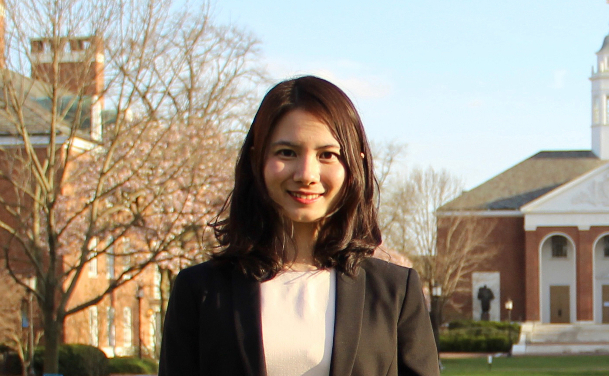

#### Research Interests
As an Assistant Professor (tenure-track) in the [Department of Biostatistics](https://www.publichealth.columbia.edu/academics/departments/biostatistics) and an affiliated member of the [Data Science Institute](https://datascience.columbia.edu/people/wenpin-hou/) at [Columbia University](https://www.columbia.edu/), Dr. Wenpin Hou is dedicated to advancing statistical machine learning methods. Her research focuses on:
- Single-cell genomics, epigenomics, and spatial transcriptomics.
- Mathematical modeling of gene regulatory networks.
- Application of Generative Pre-trained Transformer models in genomics.

#### Awards and Recognition
- [Maximizing Investigators’ Research Award (MIRA) for Early Stage Investigators](https://grants.nih.gov/grants/guide/pa-files/PAR-20-117.html) ([R35](https://reporter.nih.gov/search/Ym09DhMfd0-tUjFN97zw_w/project-details/10712174)) from [NIH/NIGMS](https://www.nigms.nih.gov/) in September 2023.
- [NIH Pathway to Independence Award (K99/R00)](https://grants.nih.gov/grants/guide/pa-files/PA-20-188.html) from [NIH/NHGRI](https://www.genome.gov/) in March 2021.

#### Collaborations
Dr. Hou collaborates across diverse fields, including cancer, immunology, infectious diseases, and more. She is part of the [ENCODE4](https://www.encodeproject.org/) consortium and is contributing to single-cell analysis.

#### Education and Training
Dr. Hou earned her Ph.D. in Mathematics from The University of Hong Kong, where she was a recipient of [University Postgraduate Fellowships](https://gradsch.hku.hk/gradsch/prospective-students/scholarship-funding-and-fees) and [Postgraduate Scholarship](https://gradsch.hku.hk/gradsch/prospective-students/scholarship-funding-and-fees). Before joining Columbia, she was a postdoctoral fellow at Johns Hopkins University in the Department of Computer Science mentored by Drs. Aravinda Chakravarti and Suchi Saria, and Department of Biostatistics, mentored by Drs. Stephanie Hicks, Hongkai Ji, Andy Feinberg, focusing on developing computational methods for inferring single-cell DNA methylation and its spatial landscape.

#### For Prospective Students
She is currently seeking students and postdoctoral fellows eager to contribute to innovative research projects on genomics.  For inquiries or to apply, please feel free to contact her or mention her name in your application.

#### More

[Columbia News about Wenpin](https://www.publichealth.columbia.edu/news/mathematician-uses-ai-find-meaning-genomic-data)

[[CV](https://github.com/Winnie09/Wenpin_Hou/blob/gh-pages/pages/Wenpin_Hou_CV.pdf)]

 
CV <a href="https://github.com/Winnie09/Wenpin_Hou/blob/gh-pages/pages/Wenpin_Hou_CV.pdf" target="_blank">here</a>.

### Contact

Wenpin Hou, Ph.D.  
[Department of Biostatistics](https://www.publichealth.columbia.edu/academics/departments/biostatistics)  
[Mailman School of Public Health](https://www.publichealth.columbia.edu/)  
[Columbia University](https://www.columbia.edu/)  
722 West 168th Street  
New York, NY 10032, USA

 [Email:]()   
 [GitHub: `Winnie09`](https://github.com/Winnie09)  
 [Google Scholar](https://scholar.google.com.hk/citations?user=1wVQpBUAAAAJ&hl=en)  
 [Twitter: `@HWenpin`](https://twitter.com/HWenpin)

