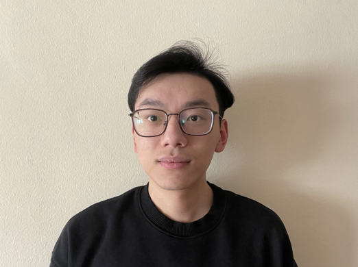
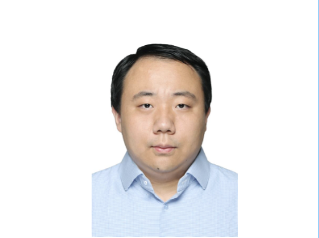

### Lab Members

  
**Wenhan Bao**, BSc.  
MSc Student (Y2021, Theory and Methods track) in Biostatistics developing statistical machine learning models for predicting DNA methylation. Upcoming PhD student at  Florida University. 

> 

  
  
**Tianchuan Gao**, BSc.  
MSc student (Y2021, Theory and Methods track) in Biostatistics developing computational methods for analyzing high-dimensional genomics data for the discovery of disease biomarkers. Upcoming PhD student at Indiana University–Purdue University Indianapolis (IUPUI).  

> 
  

  
**Jingyi Yao**,  BSc.  
MSc Student (Y2022, Theory and Methods track) in Biostatistics developing methods for integrative analysis of single-cell genomics and spatial transcriptomics data.   

> 
