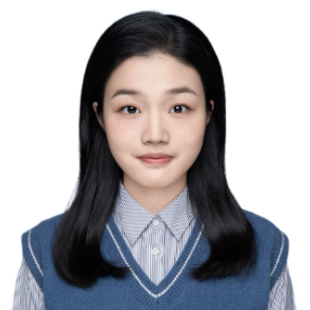
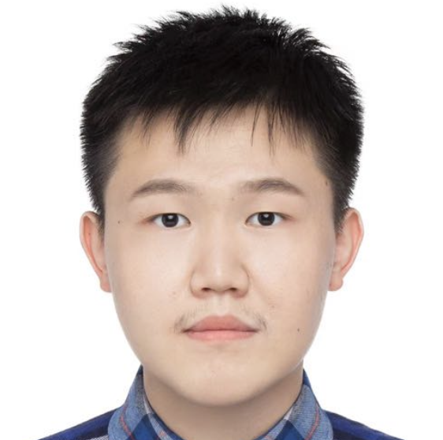

### Lab Members

  

**Won Eui Hong**,  Ph.D.     
Postdoctoral Researcher specializing in modeling gene regulatory networks using single-cell multiomics data. Holds a Ph.D. in Mathematical Sciences from Carnegie Mellon University, focusing on asymptotic behaviors of dynamical systems, variational techniques, and optimizations.  

**Jingyi Yao**,  BSc.     
MSc Student (Y2022-2024, Theory and Methods track) in Biostatistics developing methods for integrative analysis of single-cell genomics and spatial transcriptomics data. Tow Doctoral Scholars Pilot Program nominee.   

**Aiying Huang**, BSc.    
MSc Student (Y2023-2025, Public Health Data Science track) in Biostatistics developing statistical methods for multi-sample single-cell transcriptomics data. 

 

**Yifei Zhao**, BSc.    
MSc Student (Y2022-2024, Theory and Methods track) in Biostatistics developing machine learning models for gene expression and DNA methylation.

>

### Alumni

**Wenhan Bao**, BSc. MSc. (Y2021-2023, Theory and Methods track). PhD student at  Florida University. 
  
**Tianchuan Gao**, BSc. MSc.(Y2021-2023, Theory and Methods track). PhD student at Indiana University–Purdue University Indianapolis (IUPUI).  
