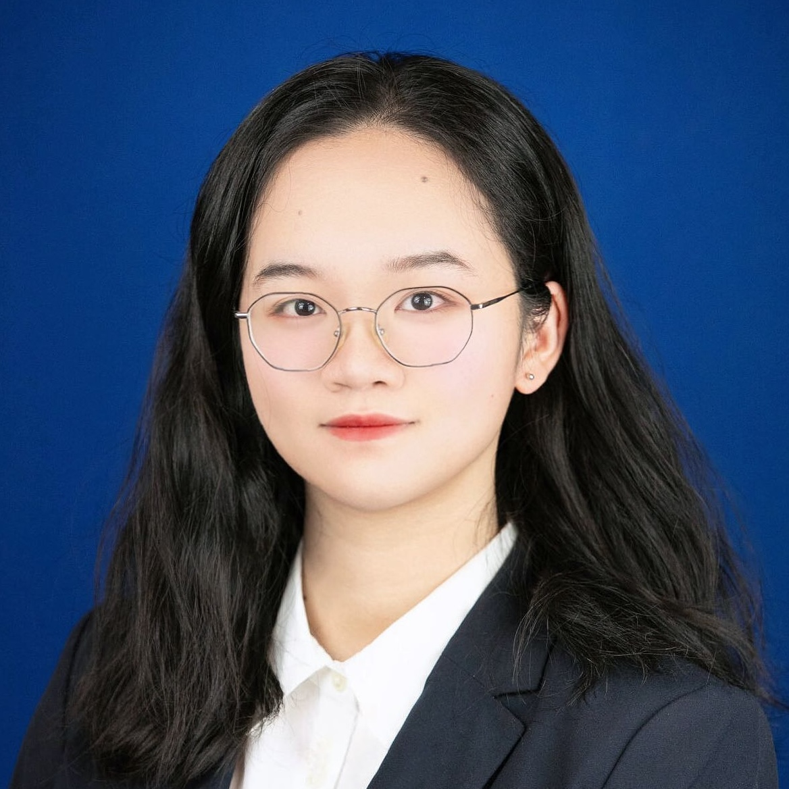

### Lab Members

  
  

    <strong>Won Eui Hong</strong>, Ph.D.  
    <strong>Postdoctoral Research Scientist</strong> focusing on modeling gene regulatory networks using single-cell multiomics data. Holds a Ph.D. in Mathematical Sciences from Carnegie Mellon University, specializing in asymptotic behaviors of dynamical systems, variational techniques, and optimizations. Jointly mentored with Dr. Ying Wei. 
  

  
  

    <strong>Qi Liu</strong>, Ph.D.  
    <strong>Postdoctoral Research Scientist</strong> (incoming) focusing on developing AI applications for healthcare and biomedical fields. Holds a Ph.D. in Electrical Engineering from City University of Hong Kong, specializing in utilizing structure-based models to achieve robustness and generalization in healthcare AI algorithms. Jointly mentored with Dr. Ying Wei (TRAIL).
    <a href="https://www.qi-liu.com/" target="_blank">[homepage]</a>
  

  
  

    <strong>Aiying Huang</strong>, BSc.  
    <strong>MSc Student</strong> (Y2023-2025, Public Health Data Science track) in Biostatistics developing statistical methods for multi-sample single-cell transcriptomics data.
  

  
  

   <strong>Lehan (Chloe) Zou</strong>, BSc.  
    <strong>MSc Student</strong> (Y2023-2025, Public Health Data Science track) in Biostatistics department interested in the trajectory analysis of single-cell data.
  

  
  

   <strong>Xinyi Shang</strong>, BSc.  
    <strong>MSc Student</strong> (Y2023-2025, Theory and Methods track) in Biostatistics, focusing on evaluating GPT models and developing statistical methods for spatial transcriptomics data.
  

### Alumni

**Yifei Zhao**, BSc. MSc. (Y2022-2024, Theory and Methods track). Computer Engineer at DISH. 

**Jingyi Yao**, BSc. MSc. (Y2022-2024, Theory and Methods track). PhD student at Boston University. 

**Wenhan Bao**, BSc. MSc. (Y2021-2023, Theory and Methods track). PhD student at Florida University. 

**Tianchuan Gao**, BSc. MSc.(Y2021-2023, Theory and Methods track). PhD student at Indiana University–Purdue University Indianapolis (IUPUI).  
