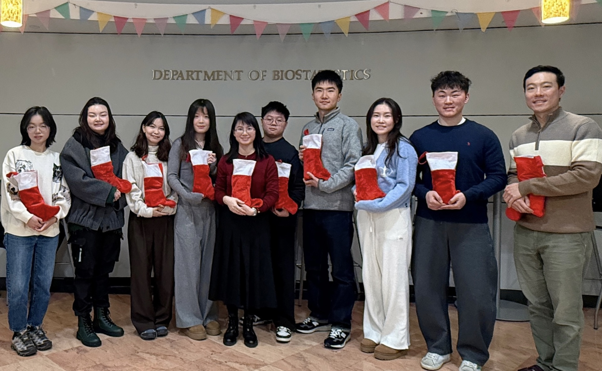
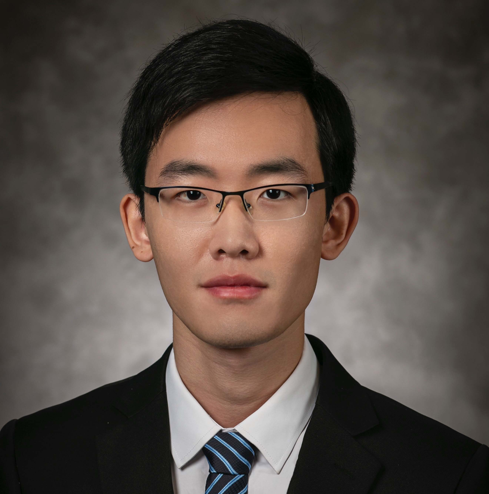
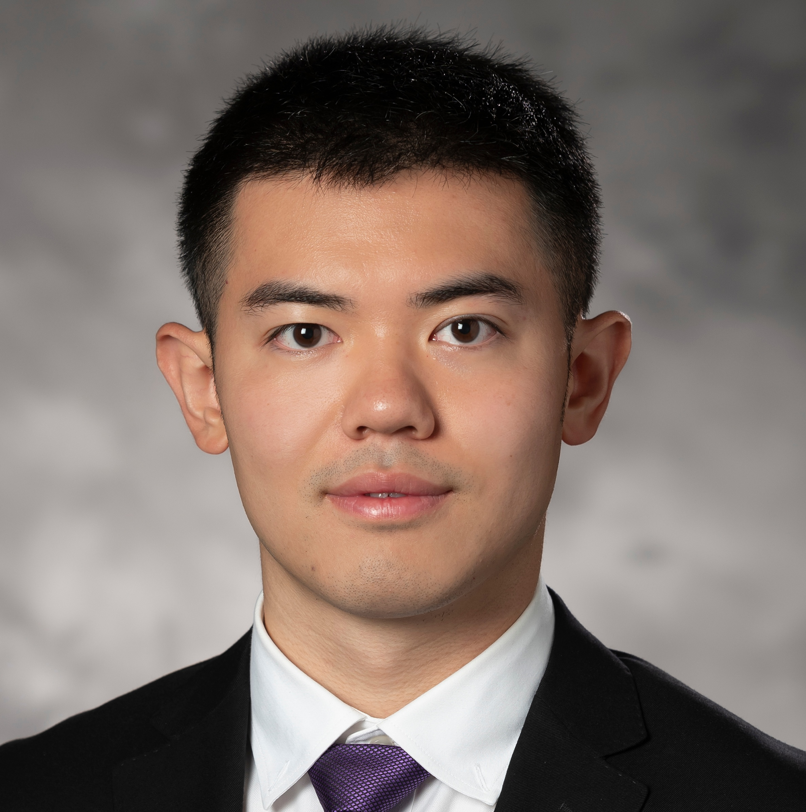

### Lab Members

  

<!-- Lab Member Section -->

  
  

    <strong>Qi Liu</strong>, Ph.D.
    
<strong>Postdoctoral Research Scientist</strong> focusing on developing AI applications for healthcare and biomedical fields. She holds a Ph.D. in Electrical Engineering from City University of Hong Kong. <a href="https://www.qi-liu.com/" target="_blank">[homepage]</a>

  

  
  

    <strong>Xu Liao</strong>, Ph.D.
    
<strong>Postdoctoral Research Scientist</strong> focusing on multi-modal modelling, representation learning and deep generative models. Holds a Ph.D. in Biostatistics and Health Data Science from Duke-NUS. <a href="https://liao-xu.github.io/" target="_blank">[homepage]</a>

  

  
  

    <strong>Xu Liao</strong>, Ph.D.
     
<strong>Postdoctoral Research Scientist</strong> focusing on spatial modeling and dynamic networks. She holds a Ph.D. in Mechanical Engineering from New York University. <a href="https://scholar.google.com/citations?user=-h7GUm8AAAAJ&hl=en" target="_blank">[homepage]</a>

  

  
  

    <strong>Chhiring Y. Lama</strong>, BSc.
    
<strong>PhD Student</strong> (Y2024-Present, Biostatistics) focusing on developing statistical and mathematical framework for analyzing genetic and genomic data. Previously, she was a Computational Research Technician at Weill Cornell Medicine, analyzing scMultiomic data to study genotype–phenotype relationships in myeloproliferative neoplasm and classic Hodgkin lymphoma.

  

  
  

    <strong>Haotian Zhuang</strong>, BSc.
    
<strong>PhD Student</strong> (Y2022-Present, Biostatistics and Bioinformatics) focusing on developing foundation models for the analysis of single-cell immune profiling data.

  

  
  

    <strong>Xingyuan Zhang</strong>, BSc.
    
<strong>PhD Student</strong> (Y2024-Present, Biostatistics and Bioinformatics) focusing on developing AI and deep learning methods for single-cell and spatial omics data.

  

  
  

    <strong>Lixia Chen Wu</strong>, BA
    
<strong>MSc student</strong> (Y2024–2026, Computer Science), focusing on integrating deep learning models with single-cell and spatial multi-omics data for genomic analyses and disease biomarker discovery.

  

  
  

    <strong>Charlotte Zhang</strong>, BA.
    
<strong>MSc Student</strong> (Y2025-2027, Biostatistics) focusing on computational epigenomics and multi-omics integration, with interests in machine learning for genomics and biomedical data science.

  

### Alumni

  
<strong>Xun Sun</strong>, MSc. (Y2024-2026), Project Manager at Abaka AI.

  
<strong>Matthew D. Eichner</strong>, BSc. (Y2024-2025) BEST/SIBS 2024 alumni. PhD student at UC Berkeley.

  
<strong>Zitao Zhang</strong>, MSc. (Y2024-2026), research internship program at MSK GEMS.

  
<strong>Won Eui Hong</strong>, Ph.D. (Y2024-2026), current postdoc at Columbia University.

  
<strong>Qinyu Xiong</strong>, MSc. (Y2024-2026, Advanced Machine Learning track).

  
<strong>Xinyi Shang</strong>, MSc. (Y2023-2025, Theory and Methods track). <a href="https://www.publichealth.columbia.edu/file/17750/download?token=1syJuaxU">Chair's Award for Outstanding Master's Student</a>. PhD student at UMass Amherst.

  
<strong>Aiying Huang</strong>, MSc. (Y2023-2025, Public Health Data Science track).

  
<strong>Lehan (Chloe) Zou</strong>, MSc. (Y2023-2025, Public Health Data Science track).

  
<strong>Yifei Zhao</strong>, MSc. (Y2022-2024, Theory and Methods track). Computer Engineer at DISH.

  
<strong>Jingyi Yao</strong>, MSc. (Y2022-2024, Theory and Methods track). PhD student at Boston University.

  
<strong>Wenhan Bao</strong>, MSc. (Y2021-2023, Theory and Methods track). PhD student at Florida University.

  
<strong>Tianchuan Gao</strong>, MSc.(Y2021-2023, Theory and Methods track). PhD student at Indiana University–Purdue University Indianapolis (IUPUI).

