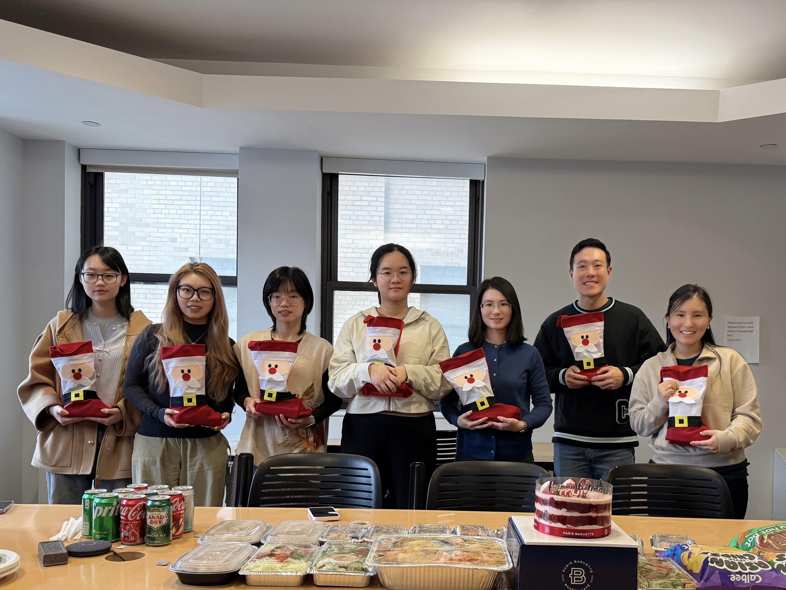
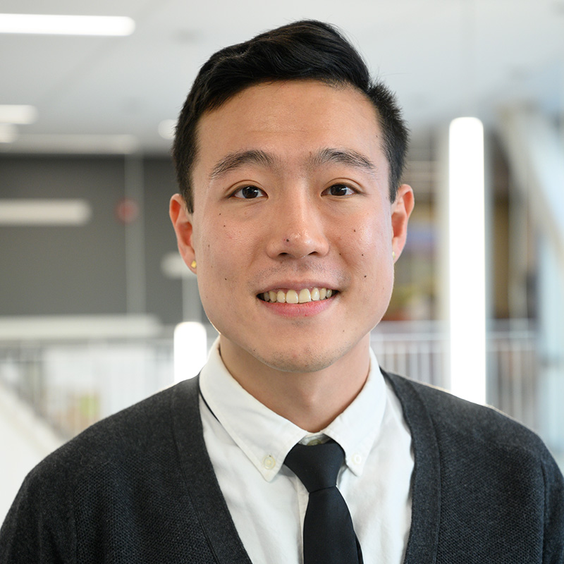
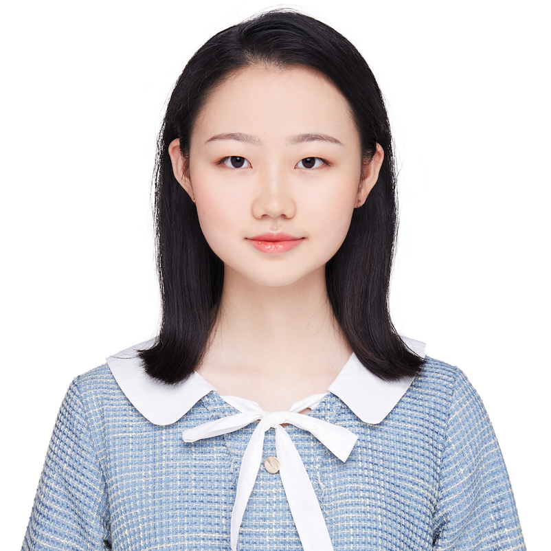
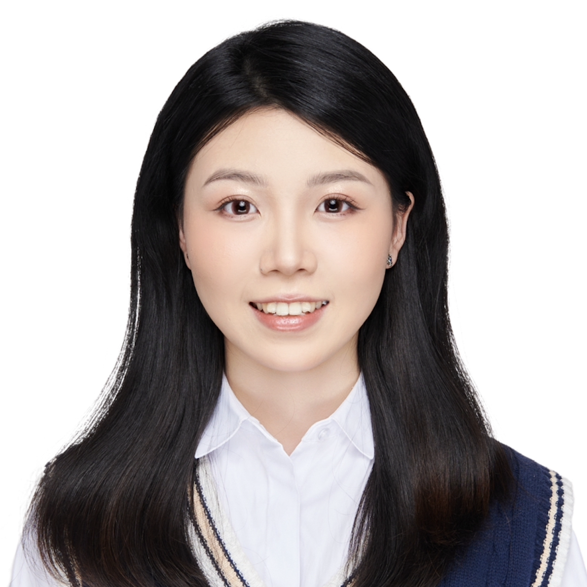
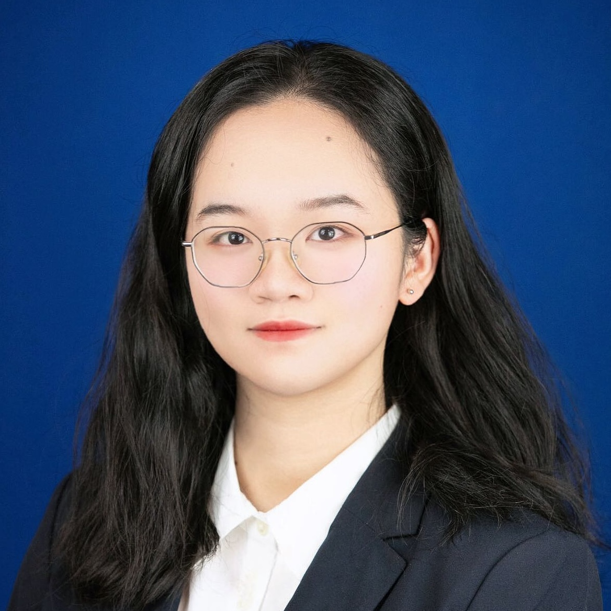
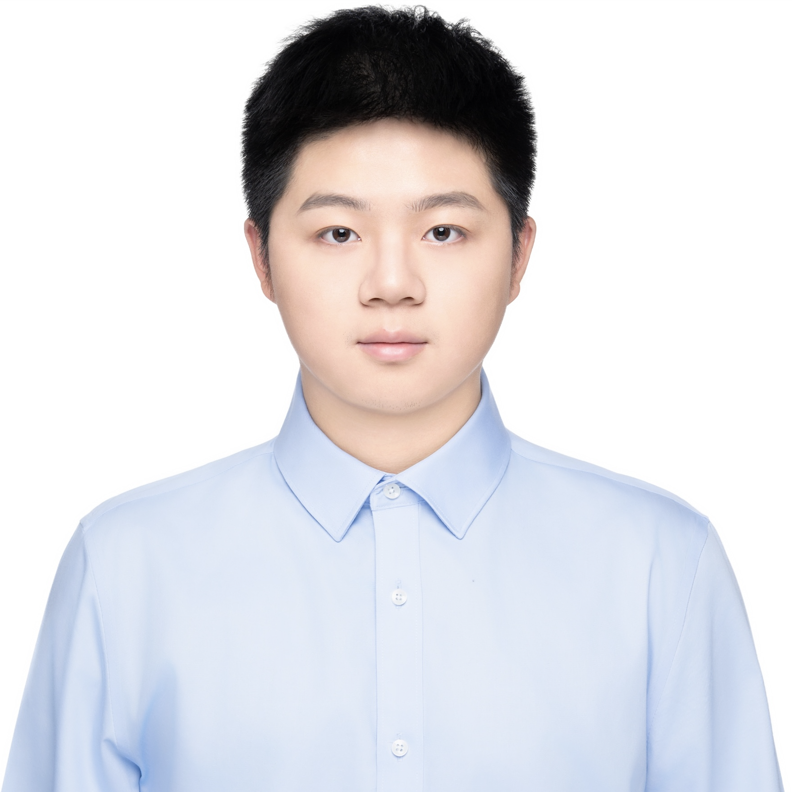

### Lab Members

<!-- Group Photo (single-column layout) -->

  

<!-- Two-column layout for individual members -->

  

    
    

      <strong>Won Eui Hong</strong>, Ph.D.  
      <strong>Postdoctoral Research Scientist</strong> 
      Modeling gene regulatory networks using single-cell multiomics data. Ph.D. from Carnegie Mellon University. Jointly mentored with Dr. Ying Wei.
    

  

  

    
    

      <strong>Qi Liu</strong>, Ph.D.  
      <strong>Postdoctoral Research Scientist</strong> 
      AI for healthcare. Ph.D. from CityU Hong Kong. Jointly mentored with Dr. Ying Wei (TRAIL). 
      <a href="https://www.qi-liu.com/" target="_blank">[homepage]</a>
    

  

  

    
    

      <strong>Xu Liao</strong>, Ph.D.  
      <strong>Postdoctoral Research Scientist</strong> 
      Specializing in RNA velocity and multi-modal modeling. Ph.D. from Duke-NUS. 
      <a href="https://liao-xu.github.io/" target="_blank">[homepage]</a>
    

  

  

    
    

      <strong>Aiying Huang</strong>, BSc.  
      <strong>MSc Student</strong> 
      (Y2023–2025) Public Health Data Science. Working on multi-sample single-cell transcriptomics.
    

  

  

    
    

      <strong>Lehan (Chloe) Zou</strong>, BSc.  
      <strong>MSc Student</strong> 
      (Y2023–2025) Public Health Data Science. Interested in trajectory analysis of single-cell data.
    

  

  

    
    

      <strong>Xinyi Shang</strong>, BSc. <strong>[Chair's Award]</strong>  
      <strong>MSc Student</strong> 
      (Y2023–2025) Theory & Methods. Evaluating GPT models and spatial transcriptomics methods.
    

  

  

    
    

      <strong>Zitao Zhang</strong>, BSc. <strong>[GEMS Intern at MSK]</strong>  
      <strong>MSc Student</strong> 
      (Y2024–2026) Theory & Methods. Modeling temporal gene expression for cancer immunotherapy.
    

  

---

### Alumni

**Yifei Zhao**, BSc. MSc. (Y2022–2024, Theory & Methods). Computer Engineer at DISH.  
**Jingyi Yao**, BSc. MSc. (Y2022–2024, Theory & Methods). PhD student at Boston University.  
**Wenhan Bao**, BSc. MSc. (Y2021–2023, Theory & Methods). PhD student at Florida University.  
**Tianchuan Gao**, BSc. MSc. (Y2021–2023, Theory & Methods). PhD student at IUPUI.  
